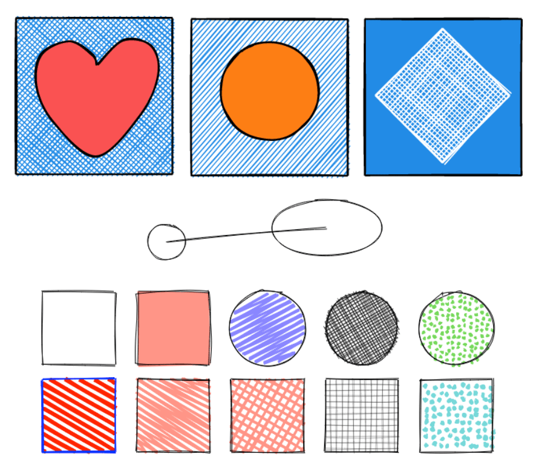
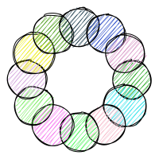

# Combine with Rough.js

> [Rough.js](https://roughjs.com/) is a small graphics library that lets you draw in a sketchy, hand-drawn-like, style. The library defines primitives to draw lines, curves, arcs, polygons, circles, and ellipses. It also supports drawing SVG paths.



[Rough.js](https://roughjs.com/) is able to produce SVG files
that can then be embedded by `fpdf2`.

This documentation page will guide you on how to do so.

Because there is no Python port of Rough.js,
this tutorial requires that you install [Node.js](https://nodejs.org/fr) & [npm](https://www.npmjs.com/) to be able to execute Javascript code.

## Producing SVG with Rough.js
First, install the required dependencies:
```
npm install roughjs xmldom
```

Create some graphics using Rough.js API in Javascript.
As a starting point, you can copy the following code in a `gen-svg.mjs` file:
```javascript
import { DOMImplementation, XMLSerializer } from "xmldom";
import roughjs from "roughjs/bundled/rough.cjs.js";
const { svg: roughSvg } = roughjs;

// Creating <svg> element:
const document = new DOMImplementation().createDocument("http://www.w3.org/1999/xhtml", "html", null);
const svg = document.createElementNS("http://www.w3.org/2000/svg", "svg");
svg.setAttribute("viewBox", "0 0 200 200");  // max-X = max-Y = 200

// Drawing rosace using Rough.js:
const rc = roughSvg(svg);
const center = {x: 100, y: 100}
const bigRadius = 66, smallRadius = 50;
const count = 12;
const letters = "0123456789abcdef";
for (let i = 0; i < count; i++) {
  const randColor = '#' + [...Array(6)].map(_ => letters[Math.floor(Math.random() * 16)]).join('');
  svg.appendChild(rc.circle(center.x + bigRadius*Math.cos(i * 2*Math.PI/count),
                            center.y + bigRadius*Math.sin(i * 2*Math.PI/count),
                            smallRadius, { fill: randColor }));
}

// Writing SVG to file:
const xmlSerializer = new XMLSerializer();
await writeFile("graphics.svg", xmlSerializer.serializeToString(svg));
```

Then execute this code:
```
node gen-svg.mjs
```

A `graphics.svg` file should be produced, similar to this one:


!!! info "Tip"

    Alternatively, you can convert an **existing SVG file** to a Rough.js-sketchy version using for example [svg2roughjs](https://github.com/fskpf/svg2roughjs).

## Embedding Rough.js SVG files
Nothing fancy there, just embedding a SVG image file as described on the [SVG](SVG.md) page:
```python
from fpdf import FPDF

pdf = FPDF()
pdf.add_page()
pdf.image("docs/graphics.svg")
pdf.output("graphics_svg.pdf")
```
Result: [graphics_svg.pdf](./graphics_svg.pdf)
