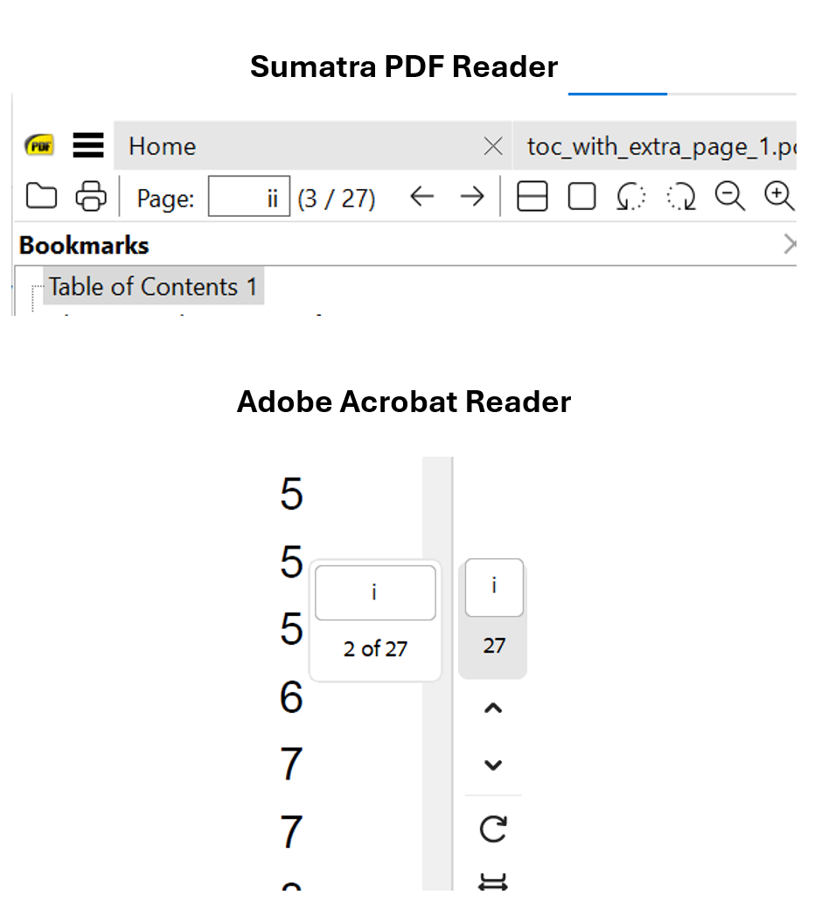

# Page Labels

_New in [:octicons-tag-24: 2.8.2](https://github.com/py-pdf/fpdf2/blob/master/CHANGELOG.md)_

## Overview

In a PDF document, each page is identified by an integer page index, representing the page's position within the document. Optionally, a document can also define **page labels** to visually display page identifiers. 

**Page labels** can be customized. For example, a document might begin with front matter numbered in roman numerals and transition to arabic numerals for the main content. In this case:
- The first page (index `0`) would have a label `i`
- The twelfth page (index `11`) would have label `xii`
- The thirteenth page (index `12`) would start with label `1`

The most popular PDF readers, such as Sumatra PDF and Adobe Acrobat Reader, will accurately display page labels as configured in the PDF. However, not all PDF readers support this feature, and some may not honor or display page labels correctly. In particular, browser-based PDF viewers, like those in Chrome and Edge, currently do not display page labels and will only show default page numbering.



---

## Page Label Components

A **page label** consists of three main parts: `Style`, `Prefix`, and `Start`.

### 1. Style
The style defines the numbering format for the numeric portion of each page label. Available styles are:

- **"D"**: Decimal Arabic numerals (1, 2, 3, ...)
- **"R"**: Uppercase Roman numerals (I, II, III, ...)
- **"r"**: Lowercase Roman numerals (i, ii, iii, ...)
- **"A"**: Uppercase letters (A to Z, then AA to ZZ, and so on)
- **"a"**: Lowercase letters (a to z, then aa to zz, and so on)

### 2. Prefix
The prefix is an optional string added before the numeric portion of each page label. For instance, a prefix of `"Appendix-"` with a style of `"D"` might result in labels like "Appendix-1", "Appendix-2", etc.

### 3. Start
The starting number for the first page of a labeled section. This is the initial numeric value applied to the first page of the label range.

---

## Using Page Labels in `fpdf2`

You can add page labels directly when adding a new page using the `add_page()` method or update them later using `set_page_label()`.

### Adding a Page with Labels in `add_page()`

When adding a page, you can specify the values for `label_style`, `label_prefix`, and `label_start` to define the page label. Here’s how to do it:

```python
from fpdf import FPDF

pdf = FPDF()

# Add a page with specific label parameters
pdf.add_page(
    label_style="r",           # Lowercase Roman numerals
    label_prefix="Preface-",   # Prefix for the label
    label_start=1              # Start numbering at 1
)
pdf.output("document_with_labels.pdf")
```

### Modifying Page Labels with `set_page_label()`

You can also modify page labels after a page has been added by using `set_page_label()`. This is helpful to set a new label after adding a ToC placeholder or other action that automatically adds a page break, but keep in mind `set_page_label()` will always happen after the header have been rendered. If you need this, prefer to have the label written on footer only.

```python
# Set a page label with style, prefix, and start value
pdf.set_page_label(
    label_style="D",           # Decimal Arabic numerals
    label_prefix="Chapter-",   # Prefix for the label
    label_start=1              # Start numbering at 1
)
```

### Retrieving the Current Page Label with `get_page_label()`

If you need to get the current page label, for example, to display it in a header or footer, you can use the `get_page_label()` method.

---

## Example Usage

Below is a complete example that demonstrates adding multiple pages with different page label styles and prefixes:

```python
from fpdf import FPDF

pdf = FPDF()

# Adding front matter with lowercase Roman numerals
pdf.add_page(label_style="r", label_start=1)  # Starts with "i", "ii", "iii", etc.

# Adding main content with decimal numbers and a prefix
pdf.add_page(label_style="D", label_prefix="Chapter-", label_start=1)  # "Chapter-1", "Chapter-2", etc.

# Adding an appendix section with uppercase letters
pdf.add_page(label_style="A", label_prefix="Appendix-", label_start=1)  # "Appendix-A", "Appendix-B", etc.

pdf.output("labeled_document.pdf")
```

This example creates a document with three sections, each using a different labeling style and prefix.