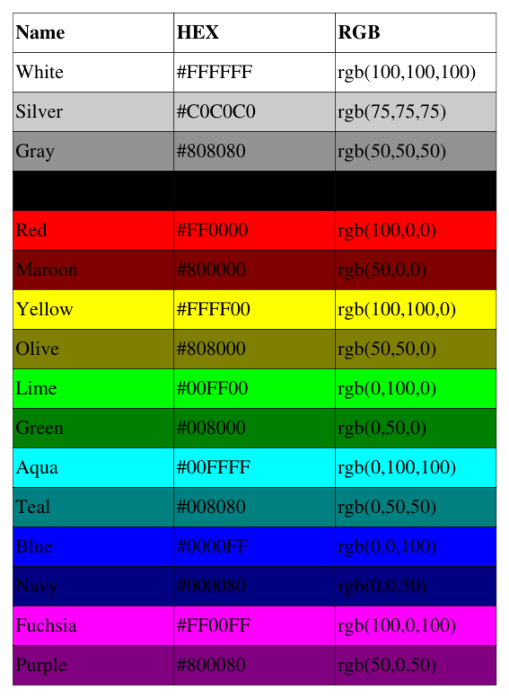

# Rendering spreadsheets as PDF tables



All the details on tables and options to style them are detailed on the dedicated page: [Tables](Tables.md).

## From a .csv spreadsheet
Example input file: [color_srgb.csv](../tutorial/color_srgb.csv)
```python

```

## From a .xlsx spreadsheet
Example input file: [color_srgb.xlsx](../tutorial/color_srgb.xlsx)
```python

```

## From an .ods spreadsheet
Example input file: [color_srgb.ods](../tutorial/color_srgb.ods)
```python

```

## From pandas DataFrame
_cf._ [Maths documentation page](Maths.md#using-pandas)
